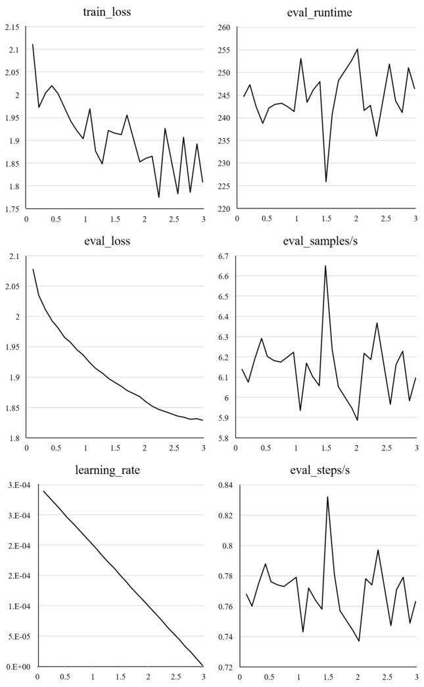

# LoRA Fine-Tuned Japanese Language Model

このリポジトリには、ユーザーのクエリに基づいてテキストを生成するためのスクリプトが含まれています。これは、LoRAでファインチューニングされたLLMを使用しており、オプションとしてテキストから音声を生成することもできます。


## 謝辞

LoRAファインチューニングを行うにあたり、npakaさんが公開してくださった「[Google Colab で Rinna-3.6B のLoRAファインチューニングを試す](https://note.com/npaka/n/nc387b639e50e)」を教科書とし、ソースコードを利用させて頂きました。使用したベースモデルは、[rinna/japanese-gpt-neox-3.6b-instruction-ppo](https://huggingface.co/rinna/japanese-gpt-neox-3.6b-instruction-ppo)であり、データセットは、[takaaki-inada/databricks-dolly-15k-ja-zundamon](https://huggingface.co/datasets/takaaki-inada/databricks-dolly-15k-ja-zundamon)を使用しました。

### LoRAファインチューニングの手順

1. **環境**：Windows11上でVisual Studio Codeを使用し、次の仕様で実行しました：
   - CPU：Ryzen5 3500
   - メモリー：32GB
   - GPU：GeForce RTX3060 12GB

**npakaさんのソースコードを以下のように一部変更しました**：

2. **データの前処理**：前処理中にデータセット全体を保持し、`tokenize_function`関数を適用してデータをトークン化しました。その後、データの10%を検証用に割り当てました。

```python

def add_text(example):
    example["text"] = generate_prompt(example)
    return example

dataset = dataset.map(add_text)

def tokenize_function(examples):
    tokens = tokenize(examples["text"], tokenizer)
    return tokens

train_dataset = dataset.map(tokenize_function, batched=True)
val_dataset = train_dataset.train_test_split(test_size=0.1)["test"]

```

3. **Trainerの設定**：TrainingArguments()にgradient_checkpointing=Trueを追加しました。学習効率の低下が可能性として考えられますが、学習時に処理するバッチサイズを大きくしてメモリーの使用量を削減することが目的でした。

```python

trainer = transformers.Trainer(
    model=model,
    train_dataset=train_dataset,
    eval_dataset=val_dataset,
    args=transformers.TrainingArguments(
        num_train_epochs=3,
        learning_rate=3e-4,
        logging_steps=20,
        evaluation_strategy="steps",
        save_strategy="steps",
        eval_steps=200,
        save_steps=200,
        output_dir=output_dir,
        report_to="none",
        save_total_limit=3,
        push_to_hub=False,
        auto_find_batch_size=True,
        gradient_checkpointing=True,
    ),
    data_collator=transformers.DataCollatorForLanguageModeling(tokenizer, mlm=False),
)

```

4. **結果**：学習可能なパラメータは約324万個（36億個の約0.09%）、実行時間は約9時間でした。ファインチューニングの結果は図の通りとなり、トレーニングと検証の損失値が両方ともエポックごとに減少しており、過学習の兆候は見られなかったと思います。また、学習率の変化は、緩やかに値が減少し、適切な調整であったこと、実行時間は比較的一貫しており、推論速度も安定していたことから、比較的良好なファインチューニングが行われたと思います。




# 使用方法
## セットアップ

ファインチューニングモデルの推論`main.py`につきましても、npakaさんが提供してくださったソースコードを使用しました。

1. `main.py`と同じディレクトリに、lora-rinnaというフォルダーを配置します。そのフォルダー内には、次のファイルを含めてください：

adapter_config.json：アダプターの構造やハイパーパラメータなどの設定を定義したJSON形式のファイル。
adapter_model.safetensors：アダプターの重みや他の学習済みパラメータを保存したファイル。

2. `requirements.txt`にリストされている必要な依存関係をインストールします：

```python

pip install -r requirements.txt

```

## UIの実行方法
ターミナルで次のコマンドを実行します：

```python

gradio main.py

```

テキストボックスにクエリを入力し、Submitボタンをクリックするとテキストが生成されます。チェックボックス(Use Text-to-Speech)をオンに選択した場合、テキストと音声ファイルが生成され、[VOICEVOX:ずんだもん](https://voicevox.hiroshiba.jp/product/zundamon/)の声で聞くことができます。

テキストから音声を生成するには、VOICEVOXエンジンが必要です。VOICEVOXエンジンは、上記のリンクから、また[GitHubのリポジトリ](https://github.com/VOICEVOX/voicevox_engine)からダウンロードできます。VOICEVOXエンジンは、使用環境に応じて設定を行ってください。

Text-to-Speechを使用する場合、事前にVOICEVOXエンジン（ローカルサーバー）を起動しておいてください。チェックボックスのデフォルトは、「オフ」になっています。
